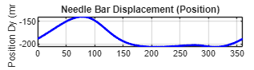

# Kinematic Analysis of Sewing Machine Needle Bar Mechanism

 

## 📌 Overview
This project presents a computational kinematic analysis of a **6-bar linkage mechanism** utilized in industrial sewing machine needle bar drives. The primary objective is to simulate the mechanism's motion and analyze the velocity profile of the needle bar (slider) relative to a constant rotary input.

The simulation uses **MATLAB** to solve vector loop equations and generate precise velocity profiles required for stitch timing (loop-taking and dwell phases).

## ⚙️ Mechanism Description


The system operates as a **function generator**, converting uniform rotary input into a specific reciprocating linear motion.
* **Input:** Rotating crank driven at constant velocity (Link 5).
* **Transmission:** A central 4-bar linkage loop ($O_5-C-A-O_2$) transmitting motion to a ternary link.
* **Output:** A connecting rod driving the vertical slider (Needle Bar).

## 🧮 Methodology
The analysis avoids approximate numerical differentiation by using **Symbolic Math**:

**1. Position Analysis**
Solves non-linear vector loop closure equations:
<div align="center">
  
</div>
<br>

**2. Velocity Analysis**
Derives exact velocity vectors using the Chain Rule:
<div align="center">
  
</div>

## 📊 Results (Preview)


<div align="center">
  
  <p><em>Figure 1: Position Profile of the Needle Bar (Slider)</em></p>
</div>

<div align="center">
  
  <p><em>Figure 2: Velocity Profile of the Needle Bar (Slider)</em></p>
</div>

The simulation results highlight two key characteristics:

1. **Position Profile:** Confirms that the needle bar operates smoothly within the required stroke length, ensuring continuous motion without mechanical locking.
2. **Velocity Profile:** Displays an **asymmetric profile** (unlike simple harmonic motion), which is specifically optimized for the **Loop-Taking phase** to ensure precise timing for the rotary hook to engage the thread.

> **⚠️ Note on Graph Artifact:**
> You may observe a momentary spike in the velocity graph. This is a **computational artifact** caused by the symbolic solver switching between solution branches (mathematical branch cut) at specific angles. It **does not** represent a physical mechanical jerk, as the actual mechanism's motion is continuous.

## 🚀 Usage
1.  Clone the repository.
2.  Open the main script in MATLAB (R2020b or later recommended).
3.  Run the script to visualize the animation and generate plots.

## 💻 Key Code Highlights

This project leverages MATLAB's **Symbolic Math Toolbox** to perform exact kinematic analysis. Instead of relying on approximate numerical methods, we derive the equations analytically.

**1. Solving Vector Loop Equations (Position Analysis)**
Here, we define the geometric constraints of the 6-bar linkage and solve for the unknown joint angles ($\theta_2, \theta_3$).

```matlab
% Define Symbolic Variables
theta2 = sym('theta_2');
theta3 = sym('theta_3');
theta4 = sym('theta_4'); % Input Driver Angle

% Define Vector Loop Equations (O2 -> A -> C -> O5)
eq1 = Ax == Cx + l3*cos(theta3);
eq2 = Ay == Cy + l3*sin(theta3);

% Solve the non-linear system symbolically
sol = solve([eq1 eq2], [theta2 theta3]);

% Select Assembly Mode 2
theta2_sol = sol.theta_2(2);
theta3_sol = sol.theta_3(2);
```

**2. Exact Velocity Derivation**
Using the Chain Rule, we calculate the instantaneous velocity of the needle bar (slider). This provides a smooth, continuous velocity profile without quantization errors
```matlab
% Define Input Speed
omega_driver = 1; % rad/s

% Calculate Angular Velocities (d_theta/dt)
omega2_sym = diff(theta2_sol, theta4) * omega_driver;
omega3_sym = diff(theta3_sol, theta4) * omega_driver;

% Calculate Linear Velocity of the Needle Bar (Slider D)
% V = d(Position)/dt
VDy_sym = diff(Dy, theta4) * omega_driver;
```
## 📂 Full Source Code
You can inspect the full MATLAB code directly below without leaving this page.

<details>
<summary><strong>CLICK HERE TO EXPAND FULL CODE 🔽</strong></summary>
<br>

```matlab
% =========================================================================
%% Kinematic Analysis of Sewing Machine Needle Bar Mechanism (6-Bar Linkage)
%  Description:
%    This script performs position and velocity analysis of a 6-bar linkage
%    used in sewing machine needle drive mechanisms. It utilizes symbolic
%    computation to solve vector loop equations and derives velocity
%    profiles using exact differentiation.
%
%  Outputs:
%    1. Animation of the mechanism motion.
%    2. Plots of angular velocities for links.
%    3. Plot of the linear velocity of the slider (Needle Bar).

clear; clc; close all;

%% ========================================================================
%  SECTION 1: SYSTEM PARAMETERS & INITIALIZATION
%  Define geometric constants and initial coordinates.
% =========================================================================

% Symbolic variables for joint angles
theta2 = sym('theta_2');
theta3 = sym("theta_3");
theta4 = sym('theta_4'); % Input Driver Angle

% Link Lengths (units: mm)
l2 = 67.5;  % Crank
AB = 55;    % Distance from A to B on ternary link
l5 = 47.5;  % Input Driver
l3 = 105;   % Coupler
l4 = 120;   % Connecting Rod to Slider

% Fixed Pivot Points (Ground)
O2x = 0;  O2y = 0;
O5x = 30; O5y = -120;

% Derived Geometry for Ternary Link (Link 2)
OB = sqrt(l2^2 + AB^2);     % Distance from O2 to B
An = atand(AB/l2);          % Offset angle of point B relative to line O2-A
ground = sqrt(O5x^2+O5y^2); % Ground distance

%% ========================================================================
%  SECTION 2: POSITION ANALYSIS (SYMBOLIC SOLVER)
%  Establish vector loop equations and solve for unknown angles.
% =========================================================================

% Define position equations for joints A and C based on angles
Ax = O2x + l2*cos(theta2);
Ay = O2y + l2*sin(theta2);
Cx = O5x + l5*cos(theta4);
Cy = O5y + l5*sin(theta4);

% --- Loop Closure Equations ---
% Vector Loop: O2 -> A -> C -> O5
eq1 = Ax == Cx + l3*cos(theta3);
eq2 = Ay == Cy + l3*sin(theta3);

% Solve the system of non-linear equations for theta2 and theta3
% (Results are functions of the driver angle theta4)
sol = solve([eq1 eq2], [theta2 theta3]);

% Select the appropriate assembly mode (Mode 2 for this mechanism)
theta2_sol = sol.theta_2(2);
theta3_sol = sol.theta_3(2);

% --- Calculate Coordinates of All Points ---
% Recalculate A and C using the solved angles
Axnew = subs(Ax, theta2, theta2_sol);
Aynew = subs(Ay, theta2, theta2_sol);

% Calculate Point B (Rigidly attached to Link 2)
Bx = O2x + OB*cos(theta2_sol - deg2rad(An));
By = O2y + OB*sin(theta2_sol - deg2rad(An));

% Calculate Slider D (Needle Bar)
% Constraint: D moves vertically along x = O5x
Dx = O5x; 
% Calculate Dy based on the fixed length of Link 4 (l4)
Dy = O2y + OB*cos(-theta2_sol+deg2rad(90+An)) - sqrt(l4^2 - (OB*sin(-theta2_sol+deg2rad(90+An))^2));

%% ========================================================================
%  SECTION 3: VELOCITY ANALYSIS (EXACT DIFFERENTIATION)
%  Calculate velocities using the chain rule with respect to time.
% =========================================================================
disp('Performing Symbolic Velocity Analysis...');

% Define Input Parameters
omega_driver = 1; % Input angular velocity (rad/s) [Constant]

% Calculate Angular Velocities (d_theta/dt = d_theta/d_theta4 * omega_driver)
omega2_sym = diff(theta2_sol, theta4) * omega_driver; 
omega3_sym = diff(theta3_sol, theta4) * omega_driver;

% Calculate Linear Velocity of the Slider (Needle)
VDy_sym = diff(Dy, theta4) * omega_driver;

%% ========================================================================
%  SECTION 4: DATA GENERATION FOR PLOTTING
%  Convert symbolic expressions to numerical functions for efficiency.
% =========================================================================
disp('Generating Numerical Data...');

% Create fast function handles from symbolic expressions
func_omega2 = matlabFunction(omega2_sym, 'Vars', theta4);
func_omega3 = matlabFunction(omega3_sym, 'Vars', theta4);
func_VDy    = matlabFunction(VDy_sym, 'Vars', theta4);

% Define range for one full rotation (0 to 360 degrees)
angle_range = deg2rad(0:1:360);

% Evaluate functions over the angle range
w2_vals = func_omega2(angle_range);
w3_vals = func_omega3(angle_range);
vD_vals = func_VDy(angle_range);

%% ========================================================================
%  SECTION 5: VISUALIZATION & ANIMATION
%  Plot the mechanism motion
% =========================================================================

% --- 5.1 Mechanism Animation ---
% Define Animation Function Handles
% Using symbolic substitution 'subs(..., t)' where t replaces theta4
h_link5 = @(t) plot([O5x subs(Cx,t)],[O5y subs(Cy,t)],"g-");
h_link2 = @(t) plot([O2x subs(Axnew,t) subs(Bx,t) O2x],[O2y subs(Aynew,t) subs(By,t) O2y],"b-");
h_link3 = @(t) plot([subs(Cx,t) subs(Axnew,t)],[subs(Cy,t) subs(Aynew,t)], "r-");
h_link4 = @(t) plot([subs(Bx,t) subs(Dx,t)],[subs(By,t) subs(Dy,t)], "k-");

figure()

link_plot = deg2rad(0:5:360);

hold on
%plot fixed pivots
plot(O5x,O5y,"k^")
plot(O2x,O2y,"k^")

%plot path of Driver link
plot(subs(Cx,link_plot), subs(Cy,link_plot), "g--")
%plot path of A on link2
plot(subs(Ax,link_plot), subs(Ay,link_plot), "r--")

fanimator(h_link5)
fanimator(h_link2)
fanimator(h_link3)
fanimator(h_link4)
%plot path of slider
plot(subs(Dx,link_plot), subs(Dy,link_plot), "m--")

grid on
hold off
axis equal

playAnimation;

xlim("auto");
ylim("auto");

xlim("auto")
ylim("auto")

% Trace paths (Optional)
link_plot = deg2rad(0:5:360);
%plot(subs(Cx,link_plot), subs(Cy,link_plot), "g--", 'HandleVisibility', 'off');
%plot(subs(Axnew,link_plot), subs(Aynew,link_plot), "r--", 'HandleVisibility', 'off');
%plot(subs(Dx,link_plot), subs(Dy,link_plot), "m--", 'HandleVisibility', 'off');

playAnimation;
xlim("auto"); ylim("auto");

%% ========================================================================
%  SECTION 6 : DATA GRAPHS (POSITION & VELOCITY)
% =========================================================================
disp('Generating Graphs...');

% --- 6.1 Create Function Handles for Fast Calculation ---
func_Dy     = matlabFunction(Dy, 'Vars', theta4);         % Position Function
func_VDy    = matlabFunction(VDy_sym, 'Vars', theta4);    % Velocity Function
func_omega2 = matlabFunction(omega2_sym, 'Vars', theta4); % Angular Velocity Function

% Define Range
angle_range = deg2rad(0:1:360);

% Calculate Values
pD_vals = func_Dy(angle_range);      % <--- (Position Values)
vD_vals = func_VDy(angle_range);     % <--- (Velocity Values)
w2_vals = func_omega2(angle_range);  % <--- (Angular Velocity Values)

% --- 6.2 Plot Results (3 Subplots) ---
figure('Name', 'Kinematic Analysis Results', 'Color', 'w');

% Graph 1: Slider Position (Displacement)
subplot(3,1,1);
plot(rad2deg(angle_range), pD_vals, 'b-', 'LineWidth', 2);
ylabel('Position Dy (mm)'); grid on;
title('Needle Bar Displacement (Position)');
xlim([0 360]);

% Graph 2: Slider Velocity
subplot(3,1,2);
plot(rad2deg(angle_range), vD_vals, 'r-', 'LineWidth', 2);
yline(0, 'k-'); % Zero line
ylabel('Velocity (mm/s)'); grid on;
title('Needle Bar Velocity');
xlim([0 360]);

% Graph 3: Angular Velocity (Check)
subplot(3,1,3);
plot(rad2deg(angle_range), w2_vals, 'g-', 'LineWidth', 2);
xlabel('Input Angle (deg)');
ylabel('Ang. Vel (rad/s)'); grid on;
title('Link 2 Angular Velocity');
xlim([0 360]);

% --- 6.3 Display Key Stats ---
stroke_length = max(pD_vals) - min(pD_vals);
fprintf('--- Analysis Results ---\n');
fprintf('Total Stroke Length: %.2f mm\n', stroke_length);
fprintf('Max Needle Velocity: %.2f mm/s\n', max(vD_vals));
% =========================================================================
% --- END ---
% =========================================================================

```

</details>

### [👉 Click Here to View and Download `Needle_Bar_Full_Code.mlx`](Needle_Bar_Full_Code.mlx)

---

## 🙏 Acknowledgments
Thank you for taking the time to view this project! I hope this analysis provides useful insights into the kinematics of sewing machine mechanisms.

---
* **Project by:** [Yuth Kanjanaprayut / Student ID: 6630276621 / Chulalongkorn University]
* **GitHub:** [Yuth-ino](https://github.com/Yuth-ino)
