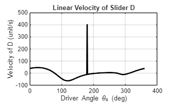

# Kinematic Analysis of Sewing Machine Needle Bar Mechanism

 

## 📌 Overview
This project presents a computational kinematic analysis of a **6-bar linkage mechanism** utilized in industrial sewing machine needle bar drives. The primary objective is to simulate the mechanism's motion and analyze the velocity profile of the needle bar (slider) relative to a constant rotary input.

The simulation uses **MATLAB** to solve vector loop equations and generate precise velocity profiles required for stitch timing (loop-taking and dwell phases).

## ⚙️ Mechanism Description
The system operates as a **function generator**, converting uniform rotary input into a specific reciprocating linear motion.
* **Input:** Rotating crank driven at constant velocity (Link 5).
* **Transmission:** A central 4-bar linkage loop ($O_5-C-A-O_2$) transmitting motion to a ternary link.
* **Output:** A connecting rod driving the vertical slider (Needle Bar).

## 🧮 Methodology
The analysis avoids approximate numerical differentiation by using **Symbolic Math**:

**1. Position Analysis**
Solves non-linear vector loop closure equations:
<div align="center">
  
</div>
<br>

**2. Velocity Analysis**
Derives exact velocity vectors using the Chain Rule:
<div align="center">
  
</div>

## 📊 Results (Preview)

<div align="center">
  
  <p><em>Figure 1: Velocity Profile of the Needle Bar (Slider)</em></p>
</div>

> The graph demonstrates the **asymmetric velocity profile**, highlighting the quick-return motion essential for high-speed sewing operations.

## 🚀 Usage
1.  Clone the repository.
2.  Open the main script in MATLAB (R2020b or later recommended).
3.  Run the script to visualize the animation and generate plots.

## 💻 Key Code Highlights

This project leverages MATLAB's **Symbolic Math Toolbox** to perform exact kinematic analysis. Instead of relying on approximate numerical methods, we derive the equations analytically.

**1. Solving Vector Loop Equations (Position Analysis)**
Here, we define the geometric constraints of the 6-bar linkage and solve for the unknown joint angles ($\theta_2, \theta_3$).

```matlab
% Define Symbolic Variables
theta2 = sym('theta_2');
theta3 = sym('theta_3');
theta4 = sym('theta_4'); % Input Driver Angle

% Define Vector Loop Equations (O2 -> A -> C -> O5)
eq1 = Ax == Cx + l3*cos(theta3);
eq2 = Ay == Cy + l3*sin(theta3);

% Solve the non-linear system symbolically
sol = solve([eq1 eq2], [theta2 theta3]);

% Select Assembly Mode 2
theta2_sol = sol.theta_2(2);
theta3_sol = sol.theta_3(2);
```

**2. Exact Velocity Derivation**
Using the Chain Rule, we calculate the instantaneous velocity of the needle bar (slider). This provides a smooth, continuous velocity profile without quantization errors
```matlab
% Define Input Speed
omega_driver = 1; % rad/s

% Calculate Angular Velocities (d_theta/dt)
omega2_sym = diff(theta2_sol, theta4) * omega_driver;
omega3_sym = diff(theta3_sol, theta4) * omega_driver;

% Calculate Linear Velocity of the Needle Bar (Slider D)
% V = d(Position)/dt
VDy_sym = diff(Dy, theta4) * omega_driver;
```
## 📂 Full Source Code
You can inspect the full MATLAB code directly below without leaving this page.

<details>
<summary><strong>CLICK HERE TO EXPAND FULL CODE 🔽</strong></summary>
<br>

```matlab
% ==========================================
%% Kinematic Analysis of Sewing Machine Needle Bar Mechanism (6-Bar Linkage)
%  Description:
%    This script performs position and velocity analysis of a 6-bar linkage.
%    It uses symbolic computation for exact solutions and visualizes the
%    result through dynamic animation and velocity profile plots.

clear; clc; close all;

%% ========================================================================
%  SECTION 1: SYSTEM PARAMETERS
% =========================================================================
theta2 = sym('theta_2');
theta3 = sym("theta_3");
theta4 = sym('theta_4'); % Input Driver Angle

% Geometric Constants (mm)
l2 = 67.5;  AB = 55;    l5 = 47.5; 
l3 = 105;   l4 = 120;
O2x = 0;    O2y = 0;
O5x = 30;   O5y = -120;

% Derived Constants
OB = sqrt(l2^2 + AB^2);
An = atand(AB/l2);
ground = sqrt(O5x^2+O5y^2);

%% ========================================================================
%  SECTION 2: POSITION ANALYSIS (SYMBOLIC)
% =========================================================================

% 2.1 Define Loop Closure Vectors
Ax = O2x + l2*cos(theta2);
Ay = O2y + l2*sin(theta2);
Cx = O5x + l5*cos(theta4);
Cy = O5y + l5*sin(theta4);

% 2.2 Solve Vector Loop Equations
eq1 = Ax == Cx + l3*cos(theta3);
eq2 = Ay == Cy + l3*sin(theta3);

sol = solve([eq1 eq2], [theta2 theta3]);
theta2_sol = sol.theta_2(2); % Assembly Mode 2
theta3_sol = sol.theta_3(2);

% 2.3 Compute Coordinates for All Joints
Axnew = subs(Ax, theta2, theta2_sol);
Aynew = subs(Ay, theta2, theta2_sol);

Bx = O2x + OB*cos(theta2_sol - deg2rad(An));
By = O2y + OB*sin(theta2_sol - deg2rad(An));

% --- FIX: Robust Calculation for Slider D ---
% Using geometric distance constraint instead of complex trig formula
% to prevent calculation errors or jumps.
Dx = O5x; 
Dy = By - sqrt(l4^2 - (Bx - Dx).^2); 

%% ========================================================================
%  SECTION 3: VELOCITY ANALYSIS
% =========================================================================
disp('Performing Symbolic Velocity Analysis...');
omega_driver = 1; % rad/s

% Calculate Velocities using Chain Rule
omega2_sym = diff(theta2_sol, theta4) * omega_driver; 
omega3_sym = diff(theta3_sol, theta4) * omega_driver;
VDy_sym    = diff(Dy, theta4) * omega_driver;

%% ========================================================================
%  SECTION 4: ANIMATION & PLOTTING
% =========================================================================
disp('Generating Animation...');

figure('Name', 'Mechanism Simulation', 'Color', 'w');
hold on; grid on; axis equal;
xlabel('X (mm)'); ylabel('Y (mm)');

% 4.1 Define Animation Function Handles
% Using symbolic substitution 'subs(..., t)' where t replaces theta4
h_link5 = @(t) plot([O5x subs(Cx,t)], ...
                    [O5y subs(Cy,t)], "g-", 'LineWidth', 2);

h_link2 = @(t) plot([O2x subs(Axnew,t) subs(Bx,t) O2x], ...
                    [O2y subs(Aynew,t) subs(By,t) O2y], "b-", 'LineWidth', 2);

h_link3 = @(t) plot([subs(Cx,t) subs(Axnew,t)], ...
                    [subs(Cy,t) subs(Aynew,t)], "r-", 'LineWidth', 2);

h_link4 = @(t) plot([subs(Bx,t) subs(Dx,t)], ...
                    [subs(By,t) subs(Dy,t)], "k-", 'LineWidth', 2);

% 4.2 Plot Static Geometry (Pivots & Paths)
plot(O5x, O5y, "k^", 'MarkerSize', 8, 'MarkerFaceColor', 'k');
plot(O2x, O2y, "k^", 'MarkerSize', 8, 'MarkerFaceColor', 'k');

% Trace Paths (Dashed Lines)
link_plot = deg2rad(0:2:360);
plot(subs(Cx,link_plot), subs(Cy,link_plot), "g--");
plot(subs(Axnew,link_plot), subs(Aynew,link_plot), "r--");
plot(subs(Dx,link_plot), subs(Dy,link_plot), "m--");

% 4.3 Execute Animation
% Set animation range to exactly one revolution (0 to 2*pi)
fanimator(h_link5, 'AnimationRange', [0 2*pi]);
fanimator(h_link2, 'AnimationRange', [0 2*pi]);
fanimator(h_link3, 'AnimationRange', [0 2*pi]);
fanimator(h_link4, 'AnimationRange', [0 2*pi]);

playAnimation; % Start Player

%% ========================================================================
%  SECTION 5: VELOCITY GRAPHS
% =========================================================================
disp('Generating Graphs...');

% Generate Numerical Data
func_omega2 = matlabFunction(omega2_sym, 'Vars', theta4);
func_VDy    = matlabFunction(VDy_sym, 'Vars', theta4);
angle_range = deg2rad(0:1:360);
w2_vals = func_omega2(angle_range);
vD_vals = func_VDy(angle_range);

% Graph 1: Angular Velocities
figure('Name', 'Velocity Profiles', 'Color', 'w');
subplot(2,1,1);
plot(rad2deg(angle_range), w2_vals, 'b-', 'LineWidth', 2);
yline(omega_driver, 'g-.');
legend('\omega_2 (Ternary)', '\omega_{in} (Driver)');
ylabel('Angular Vel (rad/s)'); grid on;
title('Link Angular Velocities');

% Graph 2: Slider Velocity
subplot(2,1,2);
plot(rad2deg(angle_range), vD_vals, 'k-', 'LineWidth', 2);
xlabel('Input Angle (deg)');
ylabel('Velocity (mm/s)'); grid on;
title('Needle Bar Velocity');

fprintf('Max Needle Velocity: %.2f mm/s\n', max(vD_vals));
```
---
*Project by [Yuth Kanjanaprayut/6630276621]*
